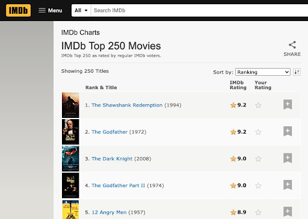
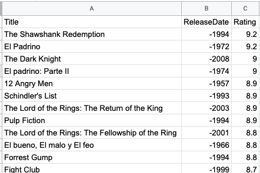
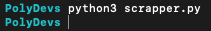
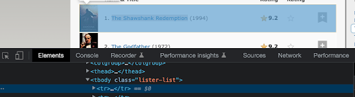
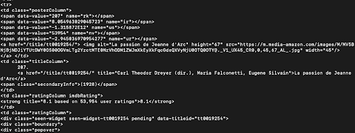
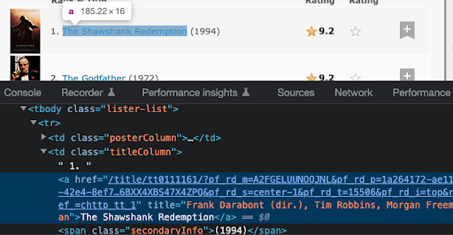
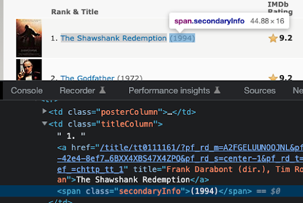
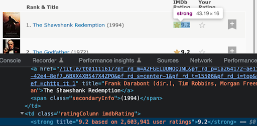

# Crear un scraper en Python en menos de 10 minutos

Algunas páginas pueden tener información que es valiosa para nuestro negocio o para entender mejor un mercado, normalmente si queremos extraer la información de estas páginas nuestra primera opción sería realizar un proceso manual engorroso que consumiría mucho tiempo y esfuerzo de una o varias personas, afortunadamente para estos casos los scripts de programación con python pueden ayudarnos a no solo ahorrar tiempo si no hacer los procesos de forma automática o masiva.

## ¿Qué es un scraper y en qué casos lo necesito?
Es el proceso por el cual de forma automática minamos, extraemos y almacenamos datos de una página web por el protocolo http, es decir, un web scraper es un programa que utilizamos para obtener grandes cantidades de datos de una página web de una forma automatizada, es como si un robot leyera toda la información y extrae la que le indiquemos

Para poder hacer web scraping se deben realizar dos procesos:
 - Fetching: obtener o descargar el contenido de la página por el protocolo http
 - Extracting: Extraer los datos que queremos de la página

## ¿Qué vamos a construir?
En este tutorial de PolyMathDevs vamos a ver cómo desarrollar un web scraper con python sobre la pagina web https://www.imdb.com/chart/top/  en la cual nos muestra una lista de las 250 mejores películas



Una vez desarrollemos nuestro script tomará la información del nombre de la pelicula, año de lanzamiento y calificación y nos guardará esta información en un csv cómo se puede ver a continuación:



## Contrucción del scraper:
Para poder realizar el scraper lo primero que vamos a realizar es obtener el contenido de la página web que estamos realizando el scraper en nuestro caso es https://www.imdb.com/chart/top/, esto lo realizamos por medio de la librería request de python y para poder manejar el contenido de la página de una forma mas clara utilizaremos la librería BeautifulSoup.

- Requests: Liberia HTTP de python para hacer http request mas faciles
- BeautifulSoup: Módulo de la librería BS4 de python que analiza la pagina y extrae la información que le indicamos y la formatea para que sea más fácil de manipular

Debemos instalar las librerías
```bash
  pip install requests bs4
```

Si no lo puedes realizar con pip puedes validar con pip3

Para validar que esté bien creamos un nuevo archivo scraper.py donde importamos las librerias
```python
import requests ,bs4
from bs4 import BeautifulSoup
```

Ejecutamos el script scraper.py 
```bash
  python scraper.py
```

Si no lo puedes realizar con python puedes validar con python3 scraper.py 



Si al ejecutar el script no obtenemos ningún error significa que tenemos bien instaladas las librerías 👍, ahora obtenemos la página web con request agregando las siguientes lineas a nuestro archivo scraper.py 
```python
url = 'https://www.imdb.com/chart/top/'
page = requests.get(url)
```

Como ya tenemos nuestra pagina web ahora vamos a utilizar BeautifulSoup para poder obtener directamente cualquier tag o elemento html que deseemos, para esto agregamos la siguiente linea nuestro script scraper.py 
```python
format_page =  BeautifulSoup(page.content, 'html.parser')
```


Ya con nuestra página en nuestro objeto format_page formateada podemos navegar por el contenido html de la página que obtuvimos con requests y extraer la información, antes de hacer esto veamos algunos ejemplos de cómo podemos obtener información con BeautifulSoup

Podemos extraer contenido de BeautifulSoup con los siguientes comandos:

| Acción | Codigo  |
| ------- | --- |
| Obtener el título de la página el elemento <title> | format_page.title |
| Obtener el body de la página el elemento <body> | format_page.body |
| Obtener el primer div que se encuentra en el body | format_page.body.div |
| Obtener todos los div’s que están en la página | format_page.find_all('div') |
| Obtener todos los div’s que están en la página con una clase* específica | format_page.find_all('div', class_='subnav_item_main') |
| Obtener el div’s que están en la página con un id especifico | format_page.find_all('div', id='success-story-929') |

> *En python la palabra class es reservada es por esto que en este método debemos pasarle el identificador class_ si quisiéramos utilizar la palabra reservada class debemos pasarla como un atributo como se muestra a continuación
```python
format_page.find_all('div', {'class':success-story-item})
```

Es importante tener presente que el contenido que retorna BeautifulSoup no es de tipo text si no de tipo tag , estamos obteniendo directamente todo el elemento tag del html
```python
print(type(format_page.body.div))
```
Si queremos obtener el contenido dentro del tag html debemos utilizar el método text
```python
print(format_page.body.div.text)
```

Teniendo lo anterior claro ahora vamos ha realizar el scraper, para esto lo primero es definir qué datos queremos obtener es diferente si queremos traer todo un objeto o sólo cierta información, para nuestro ejemplo vamos a obtener el título , la fecha de estreno y el rating de cada una de las 250 películas que están en la lista

Para esto vamos a utilizar el inspector de código sobre la página para validar que información tienen en común los bloques o cómo están construidos para poder identificar qué parámetro es sobre el cual vamos a realizar la búsqueda



Como podemos ver en la imagen todas las listas están en una tabla con la clase “lister-list” y dentro de este tabla cada película ocupa una fila , lo primero que realizaremos es obtener el body de la tabla con la clase “lister-list”, para esto agregamos la siguiente línea a nuestro script
```python
tbody = format_page.find('tbody', class_='lister-list')
```

Ahora que ya tenemos la tabla podemos obtener cada fila de la pelicula realizando un loop sobre los elementos de la tabla
```python
for movie in tbody.find_all('tr'):
	print(movie)
```

Si vemos el resultado de ejecutar nuestros script encontramos que ya tenemos el elemento tr , ahora debemos ir al detalle de cada celda para obtener:

### El nombre:

El nombre se encuentra dentro de la fila tr en una celda td con la clase “titleColum” y dento de un tag de enlace <a> , para poder obtenerlo agregamos la siguiente linea
```python
title = movie.find('td', {'class':'titleColumn'}).a.text 
```

### El año de lanzamiento:

El año de lanzamiento se encuentra dentro de la misma celda td que el nombre, solo que se encuentra dentro de un tag <span>
```python
year = movie.find('td', class_='titleColumn').span.text
```

### La Calificación(Rating):

La Calificación se encuentra dentro de la celda td con la clase “imdbRating” y dentro de un tag <strong>
```python
rating = movie.find('td', class_='imdbRating').strong.text
```


Dando por resultado final que nuestros script sea de la siguiente forma:
```python
import requests ,bs4
from bs4 import BeautifulSoup

url = 'https://www.imdb.com/chart/top/'
page = requests.get(url)
format_page =  BeautifulSoup(page.content, 'html.parser')
tbody = format_page.find('tbody', class_='lister-list')

for movie in tbody.find_all('tr'):
	title = movie.find('td', {'class':'titleColumn'}).a.text
	year = movie.find('td', class_='titleColumn').span.text
	rating = movie.find('td', class_='imdbRating').strong.text
```
	
## Guardando los datos en un archivo csv:
Ya que logramos tener toda la información de las películas que deseamos ahora vamos a almacenarla en un archivo csv, para esto vamos a importar la librería csv
```python
import csv
```
Vamos a abrir el documento csv donde vamos a guardar nuestras películas(movies.csv) y vamos a crear un writer para poder escribir en el  
```python
f = open('movies.csv', 'w')
writer = csv.writer(f)
```

Primero agregamos los headers
```python
header = ['Title', 'ReleaseDate', 'Rating']
writer.writerow(header)
```

Y vamos a guardar la información de cada película mientras recorremos la lista de objetos writer.writerow([title,year,rating])

Por último cerramos el documento movies.csv
```python
f.close()
```

Y nuestro código completo quedaría de la siguiente manera:
```python
import requests ,bs4
from bs4 import BeautifulSoup
import csv

url = 'https://www.imdb.com/chart/top/'
page = requests.get(url)
format_page =  BeautifulSoup(page.content, 'html.parser')
tbody = format_page.find('tbody', class_='lister-list')

f = open('movies.csv', 'w')
writer = csv.writer(f)

header = ['Title', 'ReleaseDate', 'Rating']
writer.writerow(header)

for movie in tbody.find_all('tr'):	
	title = movie.find('td', {'class':'titleColumn'}).a.text
	year = movie.find('td', class_='titleColumn').span.text
	rating = movie.find('td', class_='imdbRating').strong.text
	writer.writerow([title,year,rating])

f.close()
```


**Importante:** es necesario que cuando realices un scraping tengas presente las políticas de la página que deseas scrapear para estar seguro que no se está infringiendo ninguna ley, esta validación la puedes realizar también ingresando al dominio principal del sitio y agregando /robots.txt donde puedes validar si la url sobre la que estás realizando el scraper está autorizada o no , para nuestro ejemplo vamos a utilizar la página de imdb sólo con fines educativos

## Conclusiones finales
Con unas pocas líneas de código es posible obtener la información de alguna página de forma ordenada y automática, esto nos puede funcionar para hacer una migración masiva de datos de un sitio a otro , para estudios de mercado o para tener información confiable en tiempo real, si te gusto este contenido y quieres que te notifiqumos cuando publiquemos algo nuevo inscribete en nuestro newsletter aquí.

